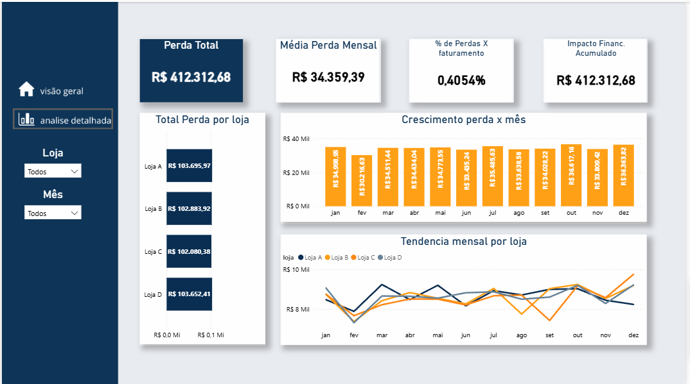

# Análise de Prevenção de Perdas – Power BI

Projeto de Business Intelligence desenvolvido com o objetivo de analisar perdas financeiras em um cenário de varejo, simulando dados reais para apoiar decisões estratégicas na área de Prevenção de Perdas.

---

## Objetivo do Projeto
Responder às seguintes perguntas de negócio:
- Onde ocorrem as maiores perdas?
- Qual tipo de perda impacta mais o resultado?
- Quais departamentos concentram o maior prejuízo?
- Como as perdas evoluem ao longo do tempo?

---

## Estrutura dos Dados
Os dados são fictícios e foram criados para fins educacionais, contemplando:
- 4 lojas
- Perdas por departamento
- Tipos de perda (avaria, vencimento, quebra e furto)
- Faturamento por período
- Calendário para análises temporais

---

## Modelagem
O modelo segue boas práticas de BI:
- Tabelas fato de perdas e faturamento
- Normalização dos tipos de perda via *unpivot*
- Tabela calendário
- Relacionamentos adequados para análises dinâmicas

---

## Principais KPIs
- Perda Total
- Média de Perda Mensal
- % de Perdas sobre o Faturamento
- Impacto Financeiro Acumulado
- Tendência Mensal de Perdas

---

## Dashboards

### 🔹 Visão Executiva – Prevenção de Perdas
Apresenta indicadores consolidados e visão macro para tomada de decisão rápida.

---

### 🔹 Análise Detalhada de Perdas
Permite aprofundar a análise por loja, tipo de perda e período.

---

## Principais Insights
- As perdas apresentam comportamento estável ao longo do período analisado.
- O impacto financeiro acumulado demonstra que pequenas perdas recorrentes geram prejuízos relevantes.
- A análise por tipo de perda possibilita direcionar ações preventivas específicas.

---

## Observações
Por se tratar de dados fictícios, alguns comportamentos podem não refletir integralmente a realidade operacional, porém o projeto demonstra corretamente conceitos de análise, modelagem e visualização de dados.

---

## Tecnologias Utilizadas
- Power BI
- Power Query
- DAX
- Modelagem Dimensional

---

## Autor
Rafael Martins  

Projeto desenvolvido para fins de portfólio e aprendizado em análise de dados.
